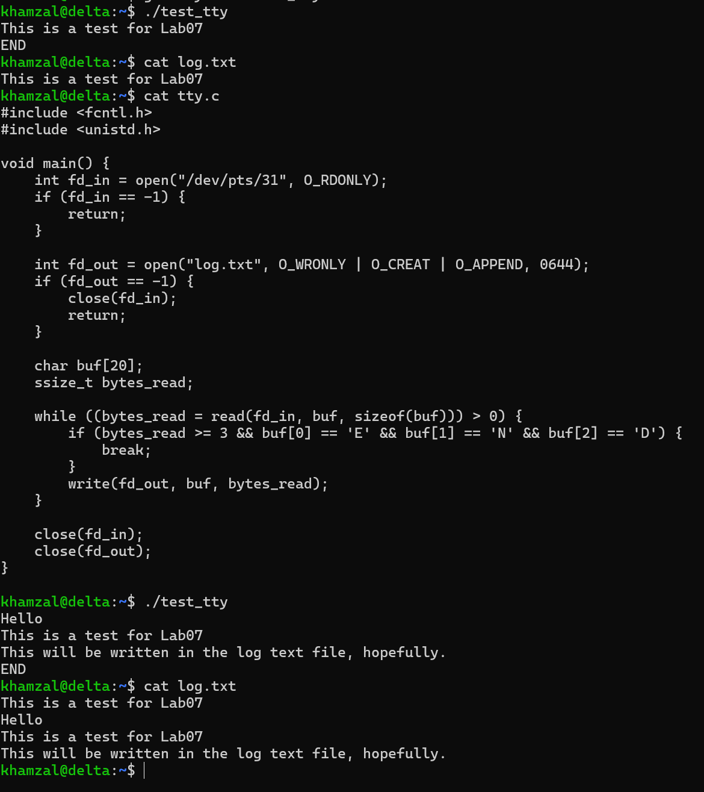
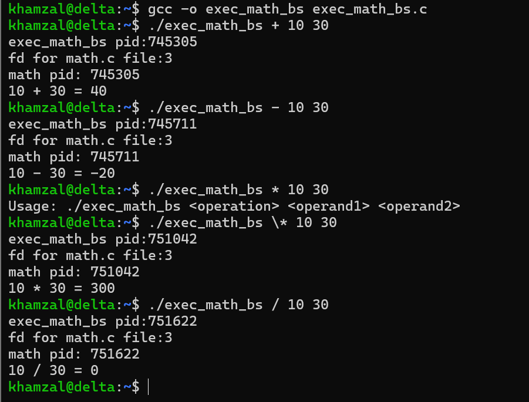
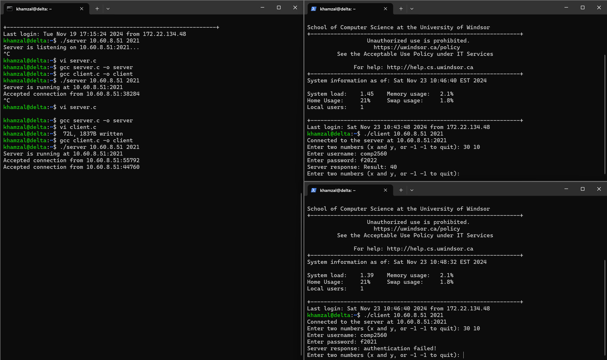

# COMP2560 - System Programming

This repository contains my coursework for COMP2560 (System Programming) at the University of Windsor, completed on the Delta server.

## Course Overview
- **Institution**: University of Windsor
- **Course**: COMP2560 - System Programming
- **Environment**: Delta server (Linux)
- **Key Topics**: Unix system calls, process management, file I/O, socket programming

## How to Run

Most labs require:
1. GCC compiler: `gcc -o output_name source_file.c`
2. Linux environment (tested on Delta server)
3. Specific permissions for some labs (TTY access, socket binding)

## Sample Lab Outputs

## Important Notes
- Some code requires specific permissions or environment setup
- Authentication credentials in lab10 are for demonstration only
- Developed and tested on the University of Windsor's Delta server
